# RentaCR — Sistema de Gestión de Alquiler de Vehículos

**Proyecto Final — IF5100 Administración de Bases de Datos**
Universidad de Costa Rica
I Semestre, 2026

---

## Información del Proyecto

| Campo | Detalle |
|-------|---------|
| **Alumno** | Kendall Trejos Cubero |
| **Carné** | C4K374 |
| **Profesor** | Luis Diego Bolaños A. |
| **Curso** | IF5100 — Administración de Bases de Datos |
| **Semestre** | I Semestre 2026 |

---

## Descripción

RentaCR es un sistema integral de gestión de alquiler de vehículos desarrollado sobre Microsoft SQL Server 2025. El sistema centraliza la gestión de personas (clientes y empleados), flota vehicular, contratos de alquiler, devoluciones, pagos y disponibilidad en tiempo real.

El proyecto implementa un ecosistema seguro con hardening de plataforma operativa y motor de base de datos, cifrado en reposo (TDE), enmascaramiento de datos sensibles (DDM), seguridad a nivel de fila (RLS), auditoría completa y funcionalidades modernas de SQL Server 2025 incluyendo Vector Search, External API calls y expresiones regulares avanzadas.

---

## Tecnologías Utilizadas

| Tecnología | Versión/Detalle |
|------------|-----------------|
| Microsoft Azure | Suscripción for Students |
| Windows Server | 2025 Datacenter Gen2 |
| SQL Server | 2025 Enterprise Evaluation (17.0.1115.1) |
| SSMS | 22 (v22.6.0) |
| Windows Defender | ATP configurado para SQL Server |
| In-Memory OLTP | MEMORY_OPTIMIZED_DATA filegroup |
| Dynamic Data Masking | email(), partial(), default() |
| Row Level Security | Por sucursal en Contrato y DisponibilidadVehiculo |
| Transparent Data Encryption | AES-256 |
| SQL Server Audit | APPLICATION_LOG — 9 action groups |
| Vector Search | VECTOR(1536) + VECTOR_DISTANCE cosine |
| External REST API | sp_invoke_external_rest_endpoint |

---

## Estándares Aplicados

| Estándar | Versión | Aplicado a |
|----------|---------|------------|
| CIS Microsoft Windows Server 2025 Benchmark | v2.0.0 | Plataforma operativa |
| CIS Microsoft SQL Server 2022 Benchmark | v1.2.1 | Motor de base de datos |

---

## Infraestructura Azure

### IaaS — SQL Server 2025 (Bloques 5-12, 14)

| Componente | Detalle |
|------------|---------|
| **VM** | vm-projectdb |
| **Región** | Canada Central |
| **Imagen** | Windows Server 2025 Datacenter Gen2 |
| **Tamaño** | Standard_B2as_v2 (2 vCPU, 8 GB RAM) |
| **Grupo de Recursos** | rg-projectdb |

### PaaS — Azure SQL Database (Bloque 13)

| Componente | Detalle |
|------------|---------|
| **Resource Group** | rg-rentacr-paas |
| **Servidor lógico** | sql-rentacr-paas.database.windows.net |
| **Base de datos** | RentaCR |
| **Tier** | Basic (5 DTUs, 2 GB) |
| **Región** | Canada Central |
| **Autenticación** | SQL + Microsoft Entra ID |
| **TLS mínimo** | 1.2 |

### Distribución de Discos (LUNs)

| Disco | Letra | Tamaño | Tipo | Propósito |
|-------|-------|--------|------|-----------|
| lun-datos | D: | 4 GB | Standard SSD | Archivos .mdf + Binarios SQL |
| lun-logs | E: | 4 GB | Standard SSD | Archivos .ldf |
| lun-tempdb | F: | 4 GB | Standard SSD | TempDB |
| lun-backups | G: | 4 GB | Standard SSD | Backups y Auditorías |

---

## Arquitectura de la Base de Datos

### Esquemas

| Esquema | Propósito | Tablas |
|---------|-----------|--------|
| `ref` | Catálogos y tablas de referencia | 12 |
| `persona` | Personas, clientes, empleados, contactos | 16 |
| `vehiculo` | Flota, categorías, seguros, disponibilidad | 8 |
| `alquiler` | Contratos, devoluciones, pagos | 5 |

**Total: 41 tablas**

---

## Estado del Proyecto

### Resumen por Bloque de Evaluación

| # | Bloque | Puntos | Estado |
|---|--------|--------|--------|
| 5 | Ecosistema (hypervisor, OS, antimalware) | 10 | ✅ Completado |
| 6 | Hardening del ecosistema (CIS WS2025) | 5 | ✅ Completado |
| 7 | Instalación y configuración SGBDR | 5 | ✅ Completado |
| 8 | Hardening SGBDR (CIS SS2022) + auditoría + TDE | 5 | ✅ Completado |
| 9 | Arquitectura de datos + LUNs + SS2025 features | 30 | ✅ Completado |
| 10 | Tablas in-memory | 3 | ✅ Completado |
| 11 | Población de la base de datos | 2 | ✅ Completado |
| 12 | Seguridad y regulación | 10 | ✅ Completado |
| 13 | Alta disponibilidad — Azure PaaS | 10 | ✅ Completado |
| 14 | Serialización JSON | 5 | ✅ Completado |
| **Total** | | **85** | |

### Detalle por Componente

| Componente | Estado | Observaciones |
|------------|--------|---------------|
| VM Azure (Windows Server 2025) | ✅ Implementado | Standard_B2as_v2, Canada Central |
| LUNs y discos separados | ✅ Implementado | 4 discos: datos, logs, tempdb, backups |
| Windows Defender ATP | ✅ Implementado | Exclusiones SQL Server configuradas |
| Hardening CIS WS2025 | ✅ Implementado | Controles omitidos justificados por entorno Azure |
| SQL Server 2025 Enterprise | ✅ Implementado | Named instance SQLSERVER2025, puerto 1434 |
| Mejores prácticas SGBDR | ✅ Implementado | max memory, MAXDOP, TLS, SA deshabilitado |
| Hardening CIS SS2022 | ✅ Implementado | Secciones 2-7 aplicadas |
| Auditoría SQL Server | ✅ Implementado | 9 action groups → APPLICATION_LOG |
| TDE (AES-256) | ✅ Implementado | Certificado respaldado en G:\SQLBackups |
| DDL completo RentaCR | ✅ Implementado | 41 tablas, 4 esquemas |
| In-Memory OLTP | ✅ Implementado | DisponibilidadVehiculo MEMORY_OPTIMIZED |
| Población de datos | ✅ Implementado | 10+ registros por tabla |
| Vistas (1 por tabla) | ✅ Implementado | 41 vistas creadas |
| Roles de base de datos | ✅ Implementado | db_Administrativo, db_Mantenimiento, db_LecturaGeneral |
| Dynamic Data Masking | ✅ Implementado | Correo, cédula, dirección |
| Row Level Security | ✅ Implementado | Por sucursal en Contrato y DisponibilidadVehiculo |
| Serialización JSON | ✅ Implementado | sp_SerializarClientesJSON probado |
| Vector Search | ✅ Implementado | VECTOR(1536) + VECTOR_DISTANCE + VECTOR_SEARCH + DiskANN (PREVIEW_FEATURES=ON) |
| External API | ✅ Implementado | sp_invoke_external_rest_endpoint con exchangerate-api.com (BCCR bloquea IPs Azure) |
| REGEXP_LIKE | ✅ Implementado | Funcional en build 17.0.1115.1 RTM-GDR — 3 SPs de validación |
| Azure SQL Database PaaS | ✅ Implementado | sql-rentacr-paas.database.windows.net — 41 tablas, DDM, RLS, TDE activos |
| Backup completo | ✅ Implementado | RentaCR_before_TDE.bak y RentaCR_post_poblacion.bak |

---

## Documentación por Bloque

| Bloque | Descripción | Pts | Doc |
|--------|-------------|-----|-----|
| 05 | Ecosistema — Azure, WS2025, Defender | 10 | [Ver →](docs/bloques/bloque05_ecosistema.md) |
| 06 | Hardening OS — CIS WS2025 v2.0.0 | 5 | [Ver →](docs/bloques/bloque06_hardening_os.md) |
| 07 | Instalación y configuración SGBDR | 5 | [Ver →](docs/bloques/bloque07_instalacion_sgbdr.md) |
| 08 | Hardening SGBDR — CIS SS2022 + Auditoría + TDE | 5 | [Ver →](docs/bloques/bloque08_hardening_sgbdr.md) |
| 09 | Arquitectura de datos — DDL, LUNs, modelo lógico | 30 | [Ver →](docs/bloques/bloque09_arquitectura_datos.md) |
| 09b | Funcionalidades SS2025 — Vector, API, RegEx | — | [Ver →](docs/bloques/bloque09b_funcionalidades_ss2025.md) |
| 10 | Tablas In-Memory OLTP | 3 | [Ver →](docs/bloques/bloque10_tablas_inmemory.md) |
| 11 | Población — 10+ registros por tabla | 2 | [Ver →](docs/bloques/bloque11_poblacion.md) |
| 12 | Seguridad y regulación — Vistas, Roles, DDM, RLS | 10 | [Ver →](docs/bloques/bloque12_seguridad.md) |
| 13 | Alta disponibilidad — Azure PaaS | 10 | [Ver →](docs/bloques/bloque13_alta_disponibilidad.md) |
| 14 | Serialización JSON | 5 | [Ver →](docs/bloques/bloque14_serializacion_json.md) |

---

## Estructura del Repositorio

```
rentacr-projectodb/
├── README.md
├── .gitignore
│
├── docs/
│   ├── enunciado/                          # Enunciado oficial del proyecto (PDF)
│   ├── requerimientos/                     # Requerimientos funcionales V1 y V2 (Word)
│   └── bloques/                            # Documentación por bloque de evaluación
│       ├── bloque05_ecosistema.md
│       ├── bloque06_hardening_os.md
│       ├── bloque07_instalacion_sgbdr.md
│       ├── bloque08_hardening_sgbdr.md
│       ├── bloque09_arquitectura_datos.md
│       ├── bloque09b_funcionalidades_ss2025.md
│       ├── bloque10_tablas_inmemory.md
│       ├── bloque11_poblacion.md
│       ├── bloque12_seguridad.md
│       ├── bloque13_alta_disponibilidad.md
│       ├── bloque14_serializacion_json.md
│       └── backup_restore.md
│
├── sql/
│   ├── ddl/                                # DDL completo — 41 tablas, 4 esquemas
│   ├── dml/                                # Scripts de población (10+ registros/tabla)
│   ├── seguridad/                          # Vistas, roles, DDM, RLS, CIS SS2022
│   ├── funcionalidades/                    # Vector Search, External API, RegEx
│   └── operaciones/                        # Backup y restauración
│
├── powershell/
│   ├── hardening-os/                       # CIS WS2025: script maestro + partes 1-5
│   ├── auditoria/                          # Scripts de auditoría CIS WS2025 v1 y v2
│   └── antimalware/                        # Configuración Windows Defender ATP
│
├── diagramas/
│   ├── conceptual/                         # Modelo conceptual draw.io — versión definitiva v5
│   └── logico/                             # DBML, PDF y PNG del modelo lógico
│
├── mockups/
│   ├── mockups_rentacr.html                # Visor HTML de los mockups
│   └── screens/                            # 17 pantallas PNG del sistema
│
└── CLAUDE/                                 # Contexto y configuración para Claude Code
    ├── CONTEXTO_v2.md
    ├── INSTRUCCIONES.md
    └── SKILL.md
```

---

## Checklist de Rúbrica

### Bloque 5 — Ecosistema (10 pts)
- [x] Instalación y configuración del hypervisor (Azure) — 1 pt
- [x] Instalación y configuración del sistema operativo (WS2025) — 5 pts
- [x] Instalación y configuración del antimalware para SQL Server — 4 pts

### Bloque 6 — Hardening OS (5 pts)
- [x] CIS WS2025 v2.0.0 aplicado
- [x] Controles omitidos documentados y justificados

### Bloque 7 — Instalación SGBDR (5 pts)
- [x] SQL Server 2025 Enterprise instalado — 2 pts
- [x] Mejores prácticas aplicadas (BP del curso) — 3 pts

### Bloque 8 — Hardening SGBDR (5 pts)
- [x] CIS SS2022 v1.2.1 aplicado — 3 pts
- [x] Antimalware configurado para SQL Server — 1 pt
- [x] Auditoría configurada (9 action groups) — 1 pt

### Bloque 9 — Arquitectura de datos (30 pts)
- [x] Modelo lógico creado — 10 pts
- [x] Vector Data and Semantic Search — 5 pts
- [x] External API calls — 5 pts
- [x] Expresiones regulares avanzadas — 5 pts
- [x] Solución de LUNs (diseño físico) — 5 pts

### Bloque 10 — In-Memory (3 pts)
- [x] DisponibilidadVehiculo MEMORY_OPTIMIZED — 3 pts

### Bloque 11 — Población (2 pts)
- [x] Todas las tablas con 10+ registros — 2 pts

### Bloque 12 — Seguridad (10 pts)
- [x] 41 vistas creadas — 2 pts
- [x] Roles y objetos asignados — 2 pts
- [x] DDM (correo, cédula, dirección) — 4 pts
- [x] Row Level Security por sucursal — 2 pts

### Bloque 13 — Alta Disponibilidad (10 pts)
- [x] Azure SQL Database PaaS — 10 pts

### Bloque 14 — Serialización JSON (5 pts)
- [x] sp_SerializarClientesJSON funcional con datos reales — 5 pts

---

## Mockups del Sistema

Diseño de la interfaz de usuario de RentaCR. Visualizador interactivo: [`mockups/mockups_rentacr.html`](mockups/mockups_rentacr.html)

| | | |
|---|---|---|
| 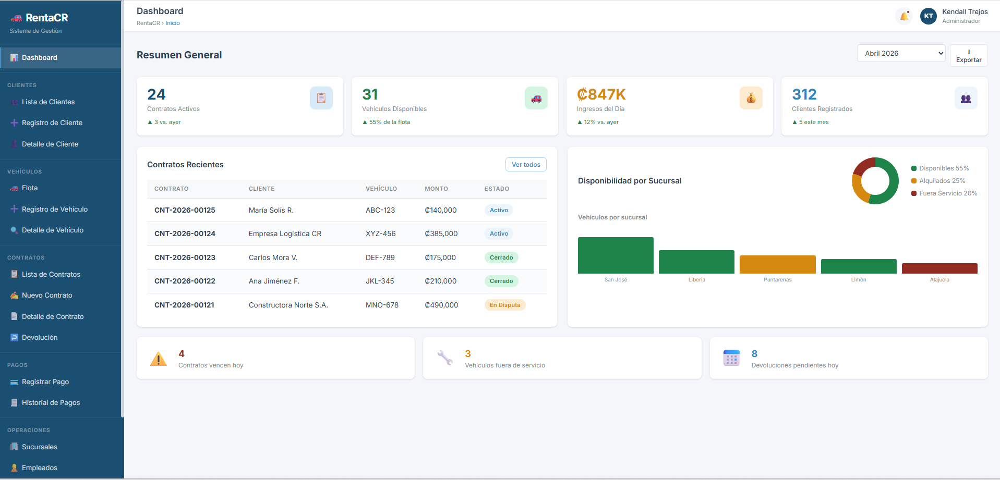 | 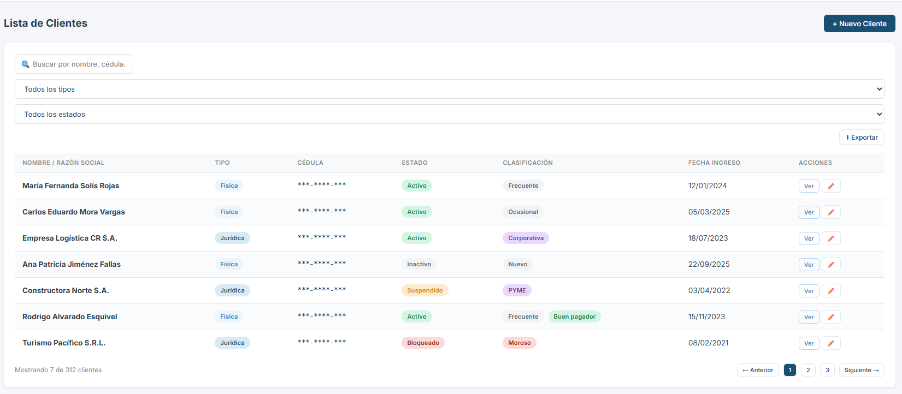 | 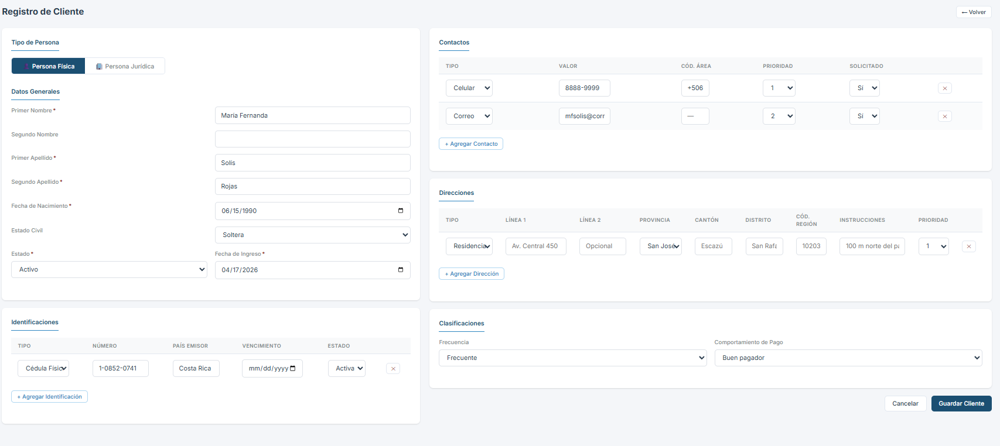 |
| **Dashboard principal** | **Lista de clientes** | **Registro cliente físico** |
| 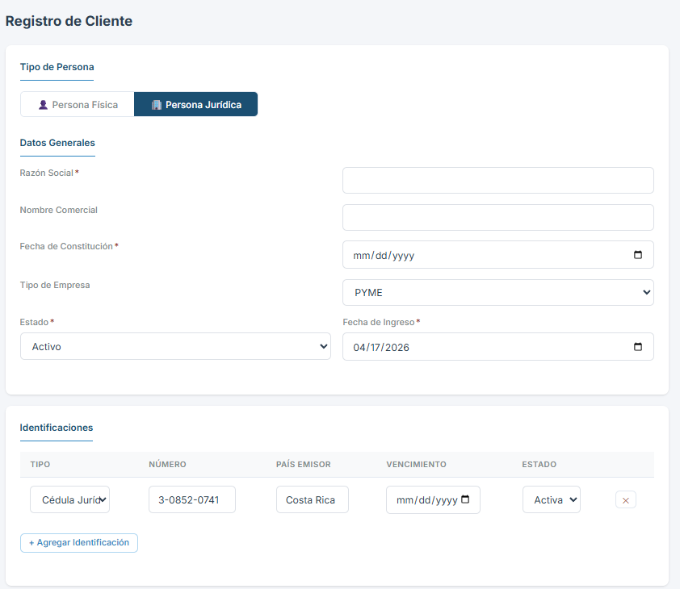 | 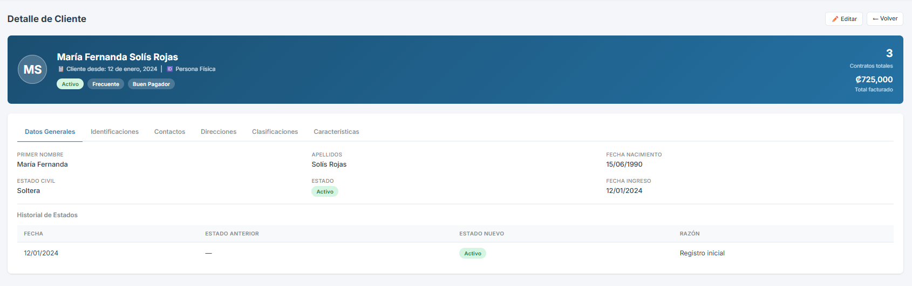 | 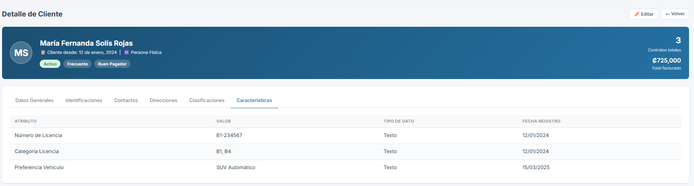 |
| **Registro persona jurídica** | **Detalle cliente — datos generales** | **Detalle cliente — características** |
| 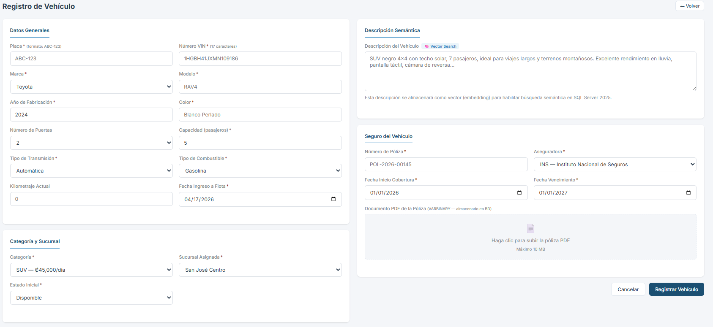 | 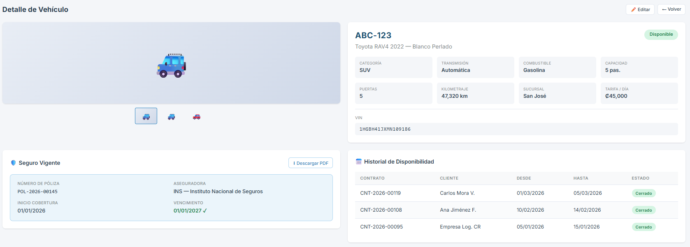 | 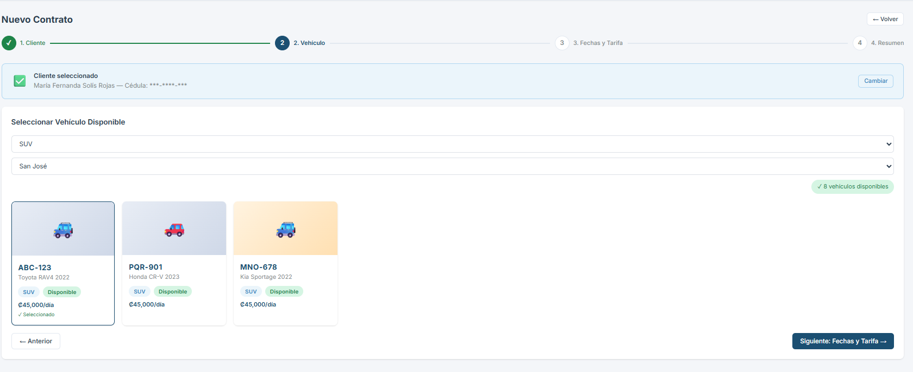 |
| **Registro de vehículo** | **Detalle de vehículo** | **Nuevo contrato — selección cliente** |
| 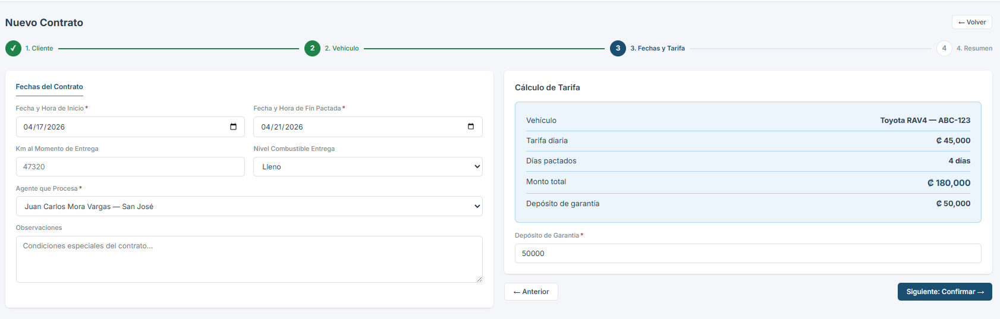 | 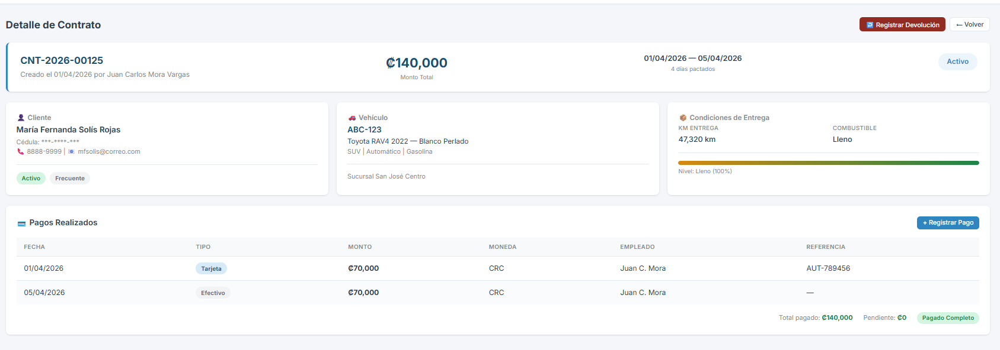 | 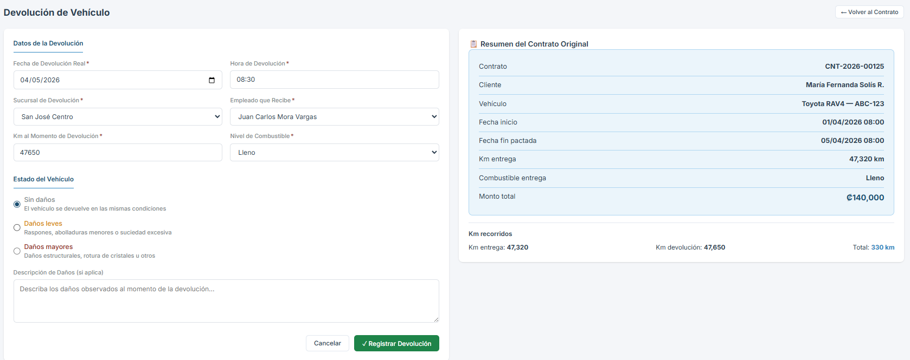 |
| **Nuevo contrato — fechas** | **Detalle de contrato** | **Devolución de vehículo** |
| 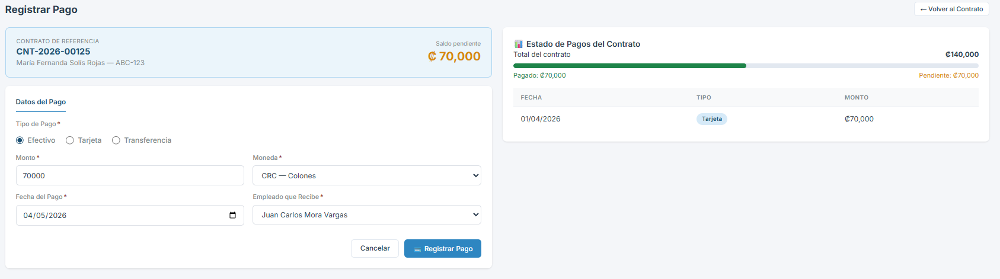 | 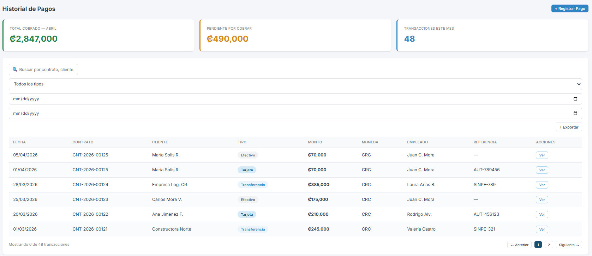 | 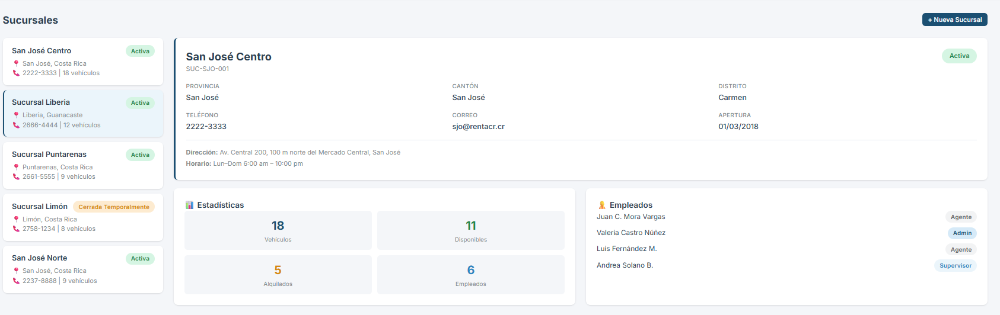 |
| **Registrar pago** | **Historial de pagos** | **Gestión de sucursales** |
| 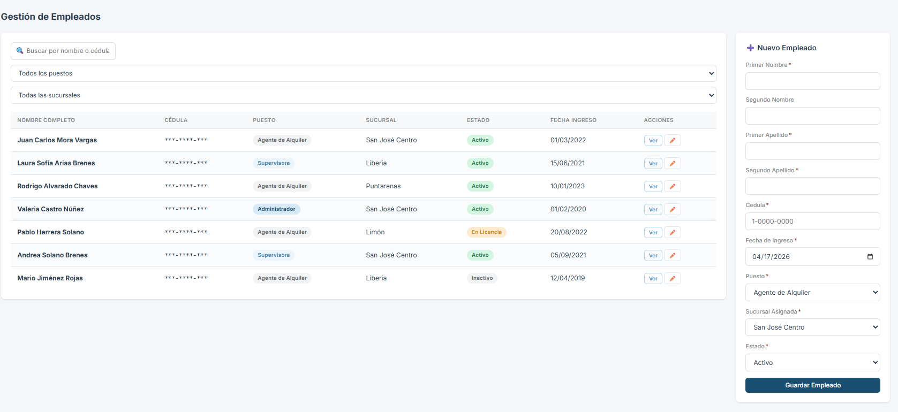 | 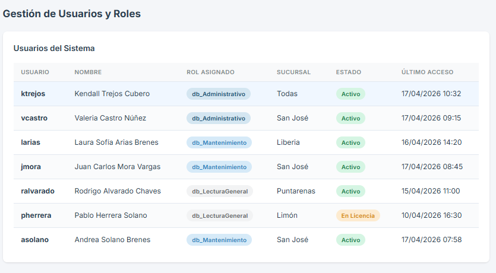 | |
| **Gestión de empleados** | **Usuarios y roles** | |
