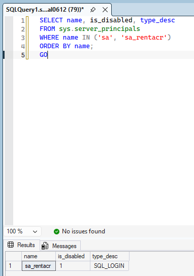
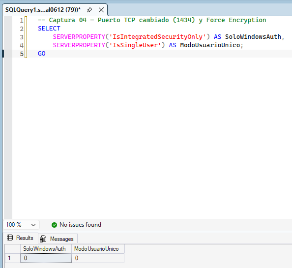
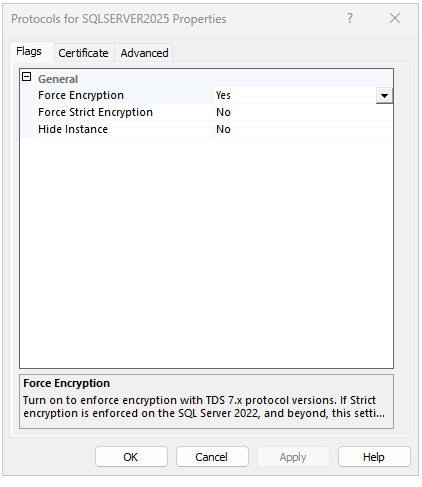
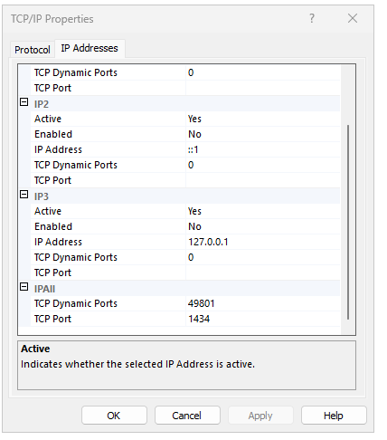
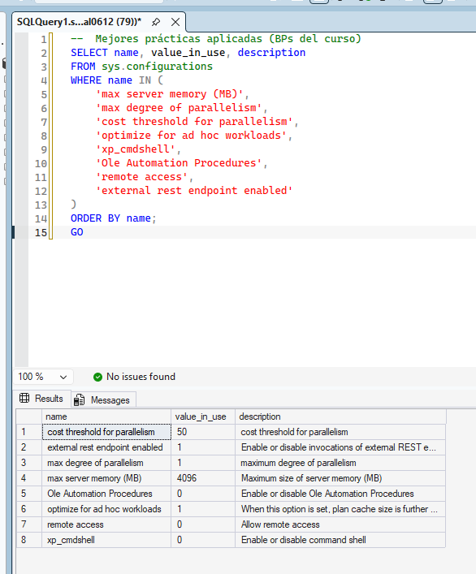
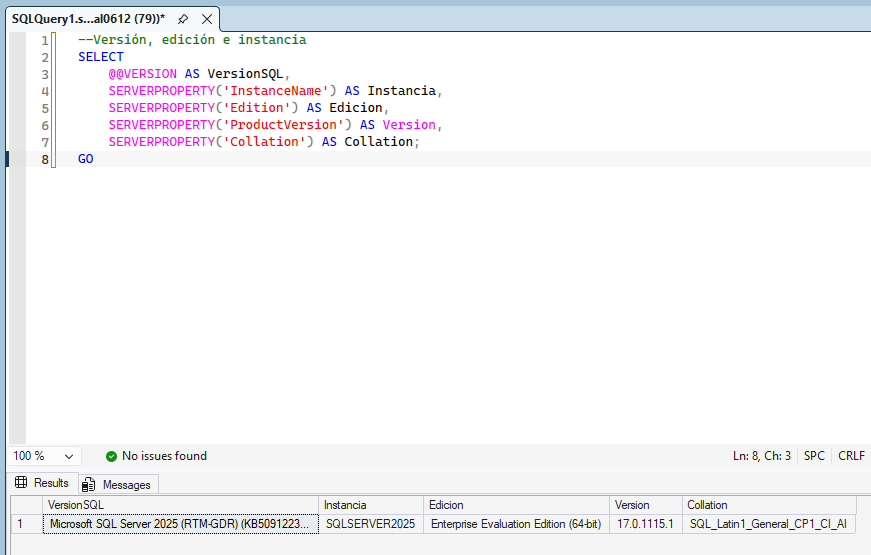

# Bloque 7 — Instalación y Configuración del SGBDR

## Objetivo
Instalación de SQL Server 2025 Enterprise con todas las mejores prácticas de configuración vistas en el curso.

**Valor:** 5 puntos | **Estado:** ✅ Completado

---

## SQL Server 2025

| Parámetro | Valor |
|-----------|-------|
| Edición | Enterprise Evaluation |
| Versión | 17.0.1115.1 (RTM-GDR) KB5091223 |
| Instancia | SQLSERVER2025 (named instance) |
| Servicio | MSSQL$SQLSERVER2025 |
| Puerto TCP | 1434 (cambiado desde 1433 por seguridad) |
| Autenticación | Mixed Mode |
| Collation | SQL_Latin1_General_CP1_CI_AI |
| SA | Renombrado a sa_rentacr — DESHABILITADO |

### Herramientas Instaladas
- SQL Server Management Studio 22 (v22.6.0)

---

## Mejores Prácticas Aplicadas (BPs del Curso)

### Configuración del Motor (sp_configure)

| Parámetro | Valor | Justificación |
|-----------|-------|---------------|
| max server memory (MB) | 4096 | 50% de 8GB RAM — deja memoria para OS |
| max degree of parallelism | 1 | VM de 2 vCPUs — evitar paralelismo excesivo |
| cost threshold for parallelism | 50 | Umbral adecuado para cargas OLTP |
| optimize for ad hoc workloads | 1 | Reduce bloat en plan cache |
| xp_cmdshell | 0 | Deshabilitado — Surface Area Reduction |
| Ole Automation Procedures | 0 | Deshabilitado — Surface Area Reduction |
| remote access | 0 | Deshabilitado — Surface Area Reduction |

### Configuración de Windows para SQL Server

| Parámetro | Valor | Justificación |
|-----------|-------|---------------|
| Power Option | High Performance | Evitar throttling de CPU |
| Win32PrioritySeparation | 24 | Prioridad a servicios en background |
| NTFS Allocation Unit | 64 KB | BP para discos de datos SQL Server |
| Force Encryption | On | TLS 1.2+ obligatorio |

### Estructura de Carpetas

```
D:\SQLBinarios\Instance   — Binarios SQL Server
D:\SQLBinarios\Shared     — Shared features
D:\SQLBinarios\Shared86   — Shared features x86
D:\SQLData                — Archivos .mdf
E:\SQLLogs                — Archivos .ldf
F:\SQLTempDB              — TempDB
G:\SQLBackups             — Backups
G:\SQLAudits              — Auditorías
```

---

## Evidencias

| # | Archivo | Descripción |
|---|---------|-------------|
| 1 |  | Login `sa` renombrado a `sa_rentacr` y deshabilitado (CIS 3.2) |
| 2 |  | Autenticación Mixed Mode (Windows + SQL Server) habilitada y verificada |
| 3 |  | Force Encryption habilitado — obliga TLS 1.2+ en todas las conexiones al motor |
| 4 |  | Puerto TCP cambiado de 1433 (default) a 1434 para reducir superficie de ataque |
| 5 |  | Versión SQL Server 2025 (17.0.1115.1) y collation SQL_Latin1_General_CP1_CI_AI confirmados |
| 6 |  | Configuración del motor via `sp_configure`: max memory 4096 MB, MAXDOP 1, optimize for ad hoc workloads habilitado |
