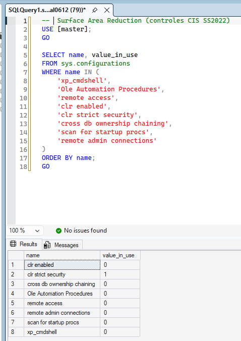
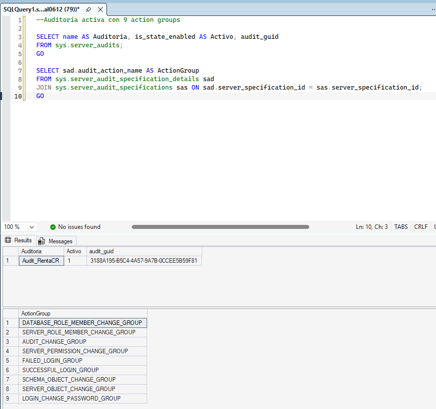
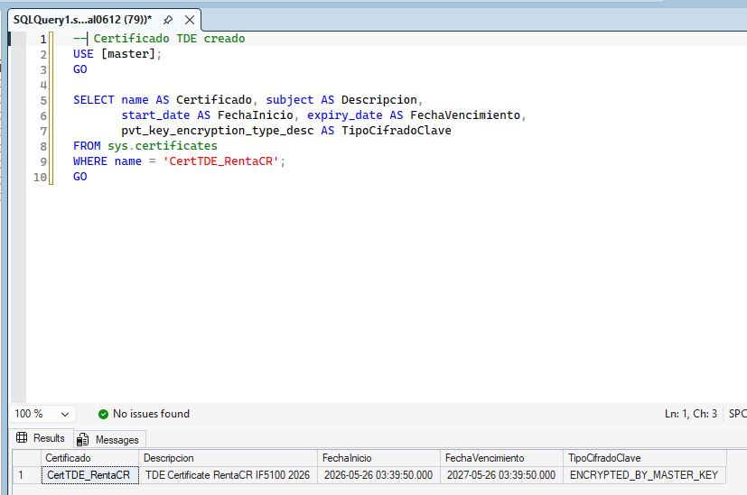
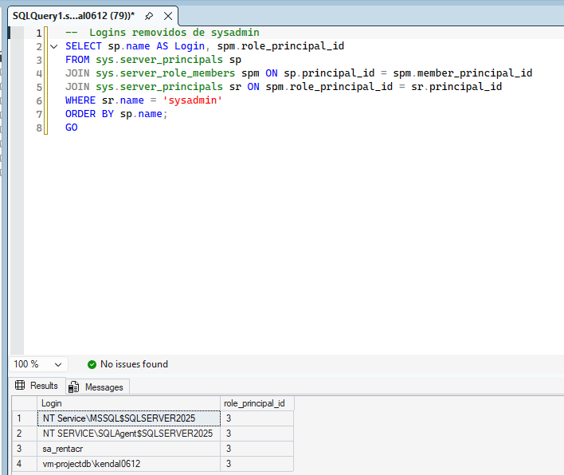
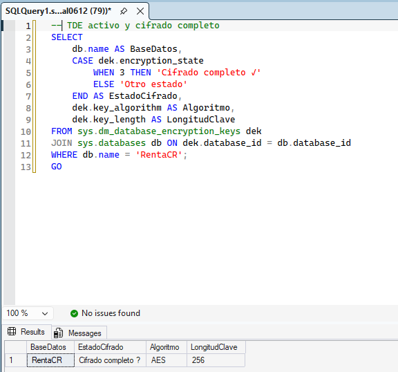
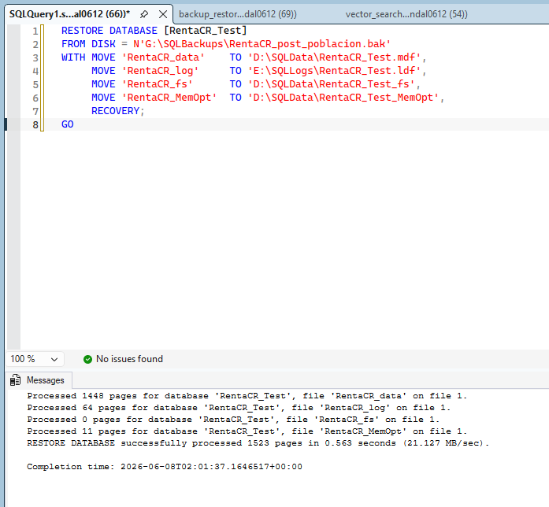

# Bloque 8 — Hardening del SGBDR

## Objetivo
Aplicar el estándar CIS Microsoft SQL Server 2022 Benchmark v1.2.1, configurar auditoría completa y cifrado TDE.

**Valor:** 5 puntos | **Estado:** ✅ Completado

---

## Estándar Aplicado

| Parámetro | Valor |
|-----------|-------|
| Guía | CIS Microsoft SQL Server 2022 Benchmark |
| Versión | v1.2.1 |

---

## Controles Aplicados por Sección

### Sección 2 — Surface Area Reduction

| Control | Configuración |
|---------|---------------|
| remote access | 0 (deshabilitado) |
| xp_cmdshell | 0 (deshabilitado) |
| Ole Automation Procedures | 0 (deshabilitado) |
| Ad Hoc Distributed Queries | 0 (deshabilitado) |
| CLR | 0 (deshabilitado) |
| CLR strict security | 1 (habilitado) |
| cross db ownership chaining | 0 (deshabilitado) |
| scan for startup procs | 0 (deshabilitado) |
| Database Mail | 0 (deshabilitado) |
| remote admin connections | 0 (deshabilitado) |

### Sección 3 — Autenticación y Cuentas

| Control | Acción |
|---------|--------|
| SA renombrado | sa → sa_rentacr |
| SA deshabilitado | LOGIN DISABLE |
| SA con política de contraseña | CHECK_POLICY=ON |
| NT SERVICE\SQLWriter | Removido de sysadmin |
| NT SERVICE\Winmgmt | Removido de sysadmin |

### Sección 4 — Políticas de Contraseña

| Login | CHECK_EXPIRATION |
|-------|-----------------|
| ##MS_PolicyEventProcessingLogin## | ON |
| ##MS_PolicyTsqlExecutionLogin## | ON |

### Sección 5 — Auditoría

| Parámetro | Valor |
|-----------|-------|
| Nombre | Audit_RentaCR |
| Destino | APPLICATION_LOG (Windows Event Log) |
| Especificación | AuditSpec_RentaCR |

**Action Groups configurados:**

| Action Group | Descripción |
|-------------|-------------|
| FAILED_LOGIN_GROUP | Intentos de login fallidos |
| SUCCESSFUL_LOGIN_GROUP | Logins exitosos |
| AUDIT_CHANGE_GROUP | Cambios en la auditoría |
| SERVER_ROLE_MEMBER_CHANGE_GROUP | Cambios en roles de servidor |
| SERVER_OBJECT_CHANGE_GROUP | Cambios en objetos del servidor |
| SCHEMA_OBJECT_CHANGE_GROUP | Cambios en esquemas |
| DATABASE_ROLE_MEMBER_CHANGE_GROUP | Cambios en roles de BD |
| LOGIN_CHANGE_PASSWORD_GROUP | Cambios de contraseña |
| SERVER_PERMISSION_CHANGE_GROUP | Cambios en permisos de servidor |

### Sección 6 — CLR

| Control | Valor |
|---------|-------|
| CLR strict security | 1 |
| Assemblies de usuario inseguros | Ninguno |

### Sección 7 — Encriptación

| Control | Valor |
|---------|-------|
| Force Encryption (7.4) | Habilitado vía registro |
| TDE — Transparent Data Encryption (7.5) | ✅ Aplicado — AES-256 |

---

## TDE — Transparent Data Encryption

| Parámetro | Valor |
|-----------|-------|
| Algoritmo | AES_256 |
| Estado | Cifrado completo (encryption_state = 3) |
| Certificado | CertTDE_RentaCR |
| Backup certificado | G:\SQLBackups\CertTDE_RentaCR.cer |
| Backup private key | G:\SQLBackups\CertTDE_RentaCR.pvk |

> **Importante:** Los archivos .mdf, .ldf y .bak de RentaCR están cifrados en disco. Sin el certificado no es posible restaurar la base de datos.

---

## Evidencias

| # | Archivo | Descripción |
|---|---------|-------------|
| 1 |  | Surface Area Reduction aplicada: xp_cmdshell, OLE Automation, remote access y CLR deshabilitados |
| 2 |  | SQL Server Audit `Audit_RentaCR` configurada con los 9 action groups enviando eventos al APPLICATION_LOG |
| 3 |  | Certificado `CertTDE_RentaCR` creado sobre la Master Key para cifrado TDE |
| 4 |  | Logins con rol sysadmin verificados — únicamente cuentas del sistema autorizadas |
| 5 |  | TDE completamente aplicado: `encryption_state = 3` (cifrado completo), algoritmo AES_256 |
| 6 |  | Restauración exitosa de la base de datos desde backup cifrado con el certificado TDE |
