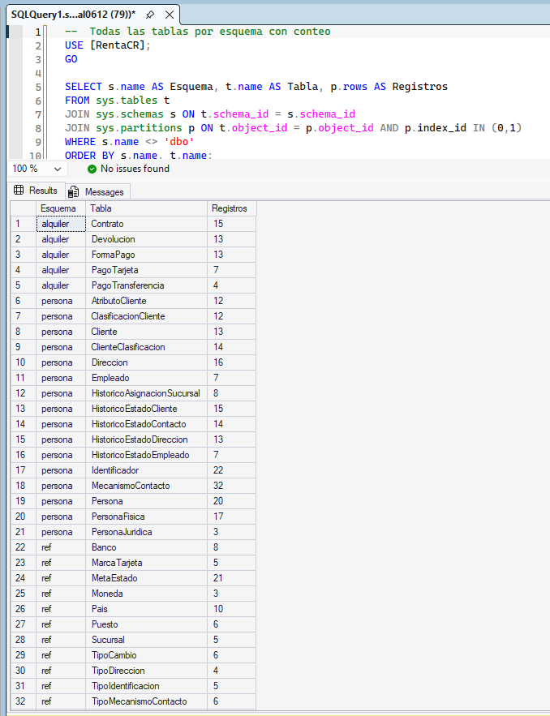
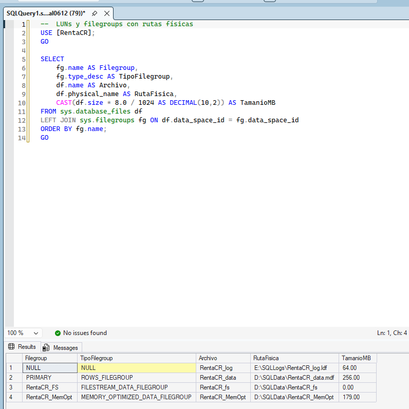

# Bloque 9 — Arquitectura de Datos

## Objetivo
Modelo de datos completo para el sistema RentaCR, con LUNs separados por tipo de archivo e implementación de las tres funcionalidades nuevas de SQL Server 2025.

**Valor:** 30 puntos | **Estado:** ✅ Completo

---

## Modelo Lógico

| Esquema | Propósito | Tablas |
|---------|-----------|--------|
| `ref` | Catálogos y tablas de referencia | 12 |
| `persona` | Personas, clientes, empleados, contactos, direcciones | 16 |
| `vehiculo` | Flota, categorías, seguros, disponibilidad | 8 |
| `alquiler` | Contratos, devoluciones, pagos | 5 |
| **Total** | | **41** |

### Tablas por Esquema

**ref:** Pais, Moneda, UbicacionGeo, MetaEstado, TipoMecanismoContacto, TipoDireccion, TipoIdentificacion, MarcaTarjeta, Banco, Puesto, TipoCambio, Sucursal

**persona:** Persona, PersonaFisica, PersonaJuridica, Cliente, HistoricoEstadoCliente, ClasificacionCliente, ClienteClasificacion, AtributoCliente, Identificador, MecanismoContacto, HistoricoEstadoContacto, Direccion, HistoricoEstadoDireccion, Empleado, HistoricoAsignacionSucursal, HistoricoEstadoEmpleado

**vehiculo:** Marca, ModeloVehiculo, CategoriaVehiculo, Vehiculo, DocumentoSeguro, ImagenVehiculo, Tarifa, DisponibilidadVehiculo

**alquiler:** Contrato, Devolucion, FormaPago, PagoTarjeta, PagoTransferencia

### Stored Procedures

| SP | Esquema | Descripción |
|----|---------|-------------|
| sp_ValidarVehiculo | vehiculo | Valida Placa y VIN con REGEXP_LIKE |
| sp_ValidarContacto | persona | Valida correo y teléfono con REGEXP_LIKE |
| sp_ValidarIdentificacion | persona | Valida cédula física con REGEXP_LIKE |
| sp_ObtenerTipoCambioBCCR | alquiler | External API BCCR |
| sp_SerializarClientesJSON | persona | Serialización JSON clientes |

### Funciones

| Función | Esquema | Descripción |
|---------|---------|-------------|
| fn_RLS_Sucursal | alquiler | Predicado RLS para tablas normales |
| fn_RLS_Sucursal_InMemory | alquiler | Predicado RLS NATIVE_COMPILATION para In-Memory |

---

## Convenciones de Código

| Objeto | Convención | Ejemplo |
|--------|------------|---------|
| Tablas | PascalCase | Cliente |
| Vistas | vw_PascalCase | vw_Cliente |
| Stored Procedures | sp_PascalCase | sp_ObtenerClientes |
| Índices | IX_Tabla_Columna | IX_Cliente_Email |
| PK | PK_Tabla | PK_Cliente |
| FK | FK_TablaHijo_TablaPadre | FK_Cliente_Persona |

---

## Funcionalidades SQL Server 2025

### 1. Vector Data and Semantic Search

| Parámetro | Detalle |
|-----------|---------|
| Columna | vehiculo.Vehiculo.DescripcionVector |
| Tipo | VECTOR(1536) |
| Métrica | cosine |
| Función | VECTOR_DISTANCE + VECTOR_SEARCH |
| Índice DiskANN | ✅ Funcional — PREVIEW_FEATURES=ON requerido |
| Estado | ✅ Completo |

> **Requisito:** `ALTER DATABASE SCOPED CONFIGURATION SET PREVIEW_FEATURES = ON;` antes de crear el índice DiskANN y usar VECTOR_SEARCH. El warning "join order enforced" al crear el índice es normal.

### 2. External API Calls

| Parámetro | Detalle |
|-----------|---------|
| Feature | sp_invoke_external_rest_endpoint |
| SP | alquiler.sp_ObtenerTipoCambioBCCR |
| API utilizada | exchangerate-api.com (BCCR bloquea IPs Azure) |
| Parseo | JSON_VALUE(@response, '$.result.rates.CRC') |
| Estado | ✅ Funcional |

### 3. Expresiones Regulares Avanzadas (REGEXP_LIKE)

| Parámetro | Detalle |
|-----------|---------|
| Función | REGEXP_LIKE |
| Versión instalada | 17.0.1115.1 (RTM-GDR) |
| Compatibility Level | 170 |
| Estado | ✅ Funcional — disponible en esta build |
| Sintaxis | `IF NOT REGEXP_LIKE(@valor, N'^patron$')` |
| SPs implementados | sp_ValidarVehiculo, sp_ValidarContacto, sp_ValidarIdentificacion |

---

## Evidencias

| # | Archivo | Descripción |
|---|---------|-------------|
| 1 |  | Tablas de RentaCR organizadas por esquema (ref, persona, vehiculo, alquiler) con conteo de registros |
| 2 |  | Consulta VECTOR_DISTANCE con métrica cosine devolviendo los vehículos más similares a un vector de búsqueda |
| 3 |  | Columna VECTOR(1536) en `vehiculo.Vehiculo.DescripcionVector` con datos vectoriales sintéticos de 15 vehículos |
| 4 |  | Stored procedures creados: validación (placa, correo, cédula), External API BCCR y serialización JSON |
| 5 |  | Filegroups y rutas físicas confirmando distribución de archivos en los LUNs D:, E:, F: y G: |
