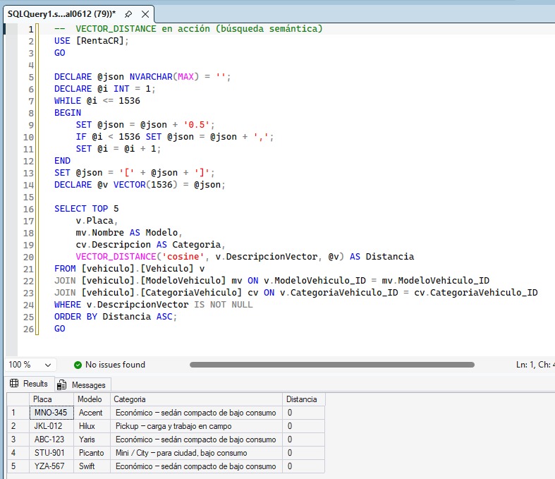
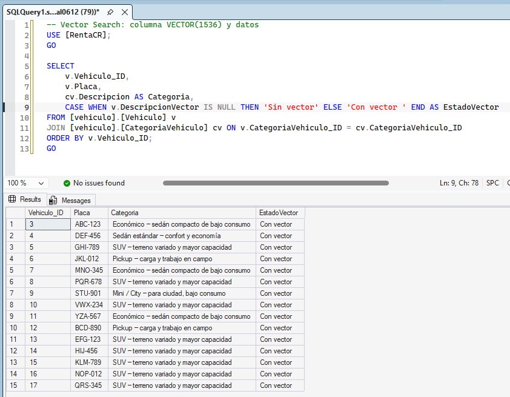
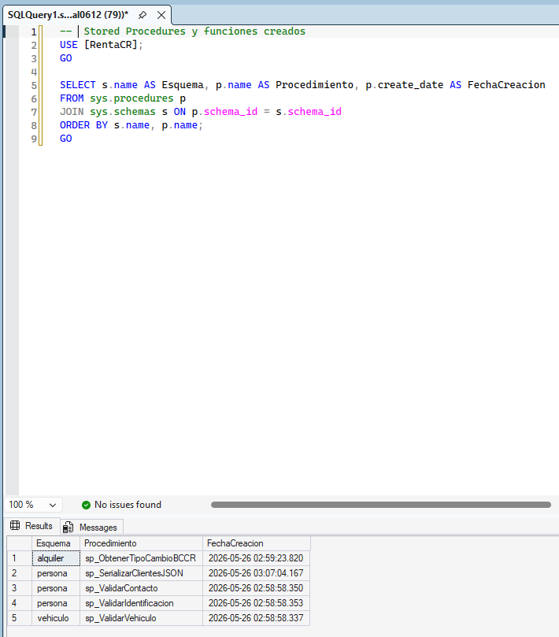

# Bloque 9 — Funcionalidades SQL Server 2025

## Objetivo
Implementar las tres nuevas funcionalidades de SQL Server 2025: Vector Search, External API calls y expresiones regulares avanzadas.

**Estado general:** ✅ Completo — todas las funcionalidades operativas en build 17.0.1115.1 RTM-GDR

---

## 1. Vector Data and Semantic Search

**Estado:** ✅ Funcional con índice DiskANN

| Componente | Estado | Detalle |
|------------|--------|---------|
| Columna VECTOR(1536) | ✅ Implementado | vehiculo.Vehiculo.DescripcionVector |
| Datos vectoriales | ✅ Implementado | 15 vehículos con vectores sintéticos |
| VECTOR_DISTANCE | ✅ Funcional | Métrica cosine probada |
| Índice DiskANN | ✅ Funcional | Creado con PREVIEW_FEATURES = ON |
| VECTOR_SEARCH | ✅ Funcional | Sintaxis FROM VECTOR_SEARCH(...) operativa |

### Habilitación de PREVIEW_FEATURES

```sql
-- Requerido antes de crear el índice DiskANN
ALTER DATABASE SCOPED CONFIGURATION SET PREVIEW_FEATURES = ON;
```

### Creación del Índice DiskANN

```sql
CREATE VECTOR INDEX IX_Vehiculo_DescripcionVector
ON [vehiculo].[Vehiculo] (DescripcionVector)
WITH (METRIC = 'cosine', TYPE = 'diskann');
-- Nota: el warning "join order enforced" es normal, no es error
```

### Consulta con VECTOR_SEARCH

```sql
-- Buscar los 5 vehículos más similares usando VECTOR_SEARCH
DECLARE @v VECTOR(1536) = (SELECT TOP 1 DescripcionVector FROM [vehiculo].[Vehiculo]);

SELECT v.Placa, mv.Nombre AS Modelo, cv.Descripcion AS Categoria, s.distance
FROM VECTOR_SEARCH(
    TABLE = [vehiculo].[Vehiculo] AS v,
    COLUMN = DescripcionVector,
    SIMILAR_TO = @v,
    METRIC = 'cosine',
    TOP_N = 5
) AS s
JOIN [vehiculo].[Vehiculo] v ON s.id = v.Vehiculo_ID
JOIN [vehiculo].[ModeloVehiculo] mv ON v.ModeloVehiculo_ID = mv.ModeloVehiculo_ID
JOIN [vehiculo].[CategoriaVehiculo] cv ON v.CategoriaVehiculo_ID = cv.CategoriaVehiculo_ID;
```

### Consulta alternativa con VECTOR_DISTANCE

```sql
SELECT TOP 5
    v.Placa,
    mv.Nombre AS Modelo,
    cv.Descripcion AS Categoria,
    VECTOR_DISTANCE('cosine', v.DescripcionVector, @vectorBusqueda) AS Distancia
FROM [vehiculo].[Vehiculo] v
JOIN [vehiculo].[ModeloVehiculo] mv ON v.ModeloVehiculo_ID = mv.ModeloVehiculo_ID
JOIN [vehiculo].[CategoriaVehiculo] cv ON v.CategoriaVehiculo_ID = cv.CategoriaVehiculo_ID
WHERE v.DescripcionVector IS NOT NULL
ORDER BY Distancia ASC;
```

---

## 2. External API Calls

**Estado:** ✅ Funcional — exchangerate-api.com

| Componente | Estado | Detalle |
|------------|--------|---------|
| sp_invoke_external_rest_endpoint | ✅ Habilitado | external rest endpoint enabled = 1 |
| SP implementado | ✅ Completo | alquiler.sp_ObtenerTipoCambioBCCR |
| API utilizada | ✅ exchangerate-api.com | BCCR bloquea IPs de Azure, se usa API alternativa |
| Parseo JSON | ✅ Funcional | JSON_VALUE(@response, '$.result.rates.CRC') |

> **Nota:** La API del BCCR bloquea rangos de IP de Azure. Se utiliza exchangerate-api.com como fuente de tipo de cambio USD→CRC. El parseo se realiza con `JSON_VALUE(@response, '$.result.rates.CRC')`.

### Stored Procedure

```sql
EXEC [alquiler].[sp_ObtenerTipoCambioBCCR]
    @FechaConsulta = '2026-05-26',
    @TipoCambio_ID = @id OUTPUT;
```

---

## 3. Expresiones Regulares (REGEXP_LIKE)

**Estado:** ✅ Funcional — disponible en build 17.0.1115.1 RTM-GDR

| Componente | Estado | Detalle |
|------------|--------|---------|
| REGEXP_LIKE | ✅ Disponible | Build 17.0.1115.1 RTM-GDR lo soporta |
| Compatibility Level | ✅ 170 | Correcto |
| SPs implementados | ✅ 3 SPs | Usan REGEXP_LIKE con sintaxis nativa |

### Sintaxis utilizada

```sql
IF NOT REGEXP_LIKE(@valor, N'^patron$')
    -- valor no cumple el patrón
```

### SPs con validación REGEXP_LIKE

| SP | Valida | Patrón |
|----|--------|--------|
| vehiculo.sp_ValidarVehiculo | Placa | `^[A-Z]{3}-[0-9]{3}$` |
| vehiculo.sp_ValidarVehiculo | VIN | `^[A-HJ-NPR-Z0-9]{17}$` |
| persona.sp_ValidarContacto | Correo | `^[^@\s]+@[^@\s]+\.[^@\s]+$` |
| persona.sp_ValidarContacto | Teléfono | `^[0-9]{8}$` |
| persona.sp_ValidarIdentificacion | Cédula física | `^[1-9]-[0-9]{4}-[0-9]{4}$` |

---

## Evidencias

Las evidencias de este bloque se encuentran en la carpeta `bloque09_arquitectura_datos` ya que comparten bloque de evaluación.

| # | Archivo | Descripción |
|---|---------|-------------|
| 1 |  | Resultado de VECTOR_DISTANCE cosine — ranking de vehículos por similitud semántica |
| 2 |  | Columna VECTOR(1536) en `vehiculo.Vehiculo` con datos vectoriales cargados |
| 3 |  | SPs de External API (`sp_ObtenerTipoCambioBCCR`) y serialización JSON visibles en el árbol de objetos |
