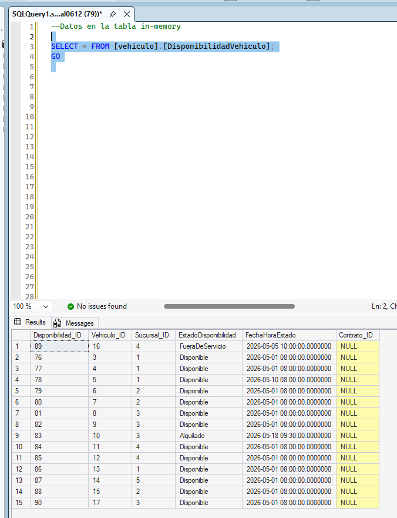
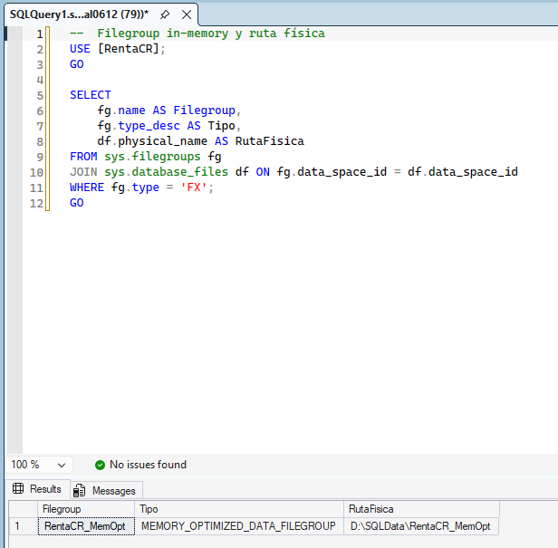
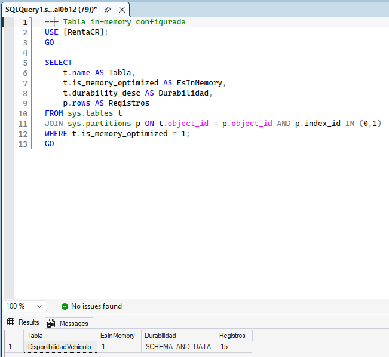

# Bloque 10 — Tablas In-Memory

## Objetivo
Implementar In-Memory OLTP para la tabla de disponibilidad de vehículos, que requiere alta concurrencia y baja latencia.

**Valor:** 3 puntos | **Estado:** ✅ Completado

---

## Configuración

| Parámetro | Valor |
|-----------|-------|
| Filegroup | RentaCR_MemOpt |
| Tipo | MEMORY_OPTIMIZED_DATA |
| Ubicación | D:\SQLData\RentaCR_MemOpt |

---

## Tabla In-Memory

### vehiculo.DisponibilidadVehiculo

| Propiedad | Valor |
|-----------|-------|
| MEMORY_OPTIMIZED | ON |
| DURABILITY | SCHEMA_AND_DATA |
| Primary Key | NONCLUSTERED |
| Registros | 15 |

### Columnas

| Columna | Tipo | Descripción |
|---------|------|-------------|
| Disponibilidad_ID | INT IDENTITY | PK |
| Vehiculo_ID | INT | FK lógica |
| Sucursal_ID | INT | FK lógica |
| EstadoDisponibilidad | NVARCHAR(30) | Disponible / Alquilado / FueraDeServicio |
| FechaHoraEstado | DATETIME2 | Timestamp del estado |
| Contrato_ID | INT NULL | Referencia al contrato activo |

---

## Row Level Security en In-Memory

La tabla in-memory utiliza una función RLS con NATIVE_COMPILATION (requerido para tablas MEMORY_OPTIMIZED):

```sql
CREATE FUNCTION [alquiler].[fn_RLS_Sucursal_InMemory](@Sucursal_ID INT)
RETURNS TABLE
WITH SCHEMABINDING, NATIVE_COMPILATION
AS
RETURN (
    SELECT 1 AS fn_result
    WHERE IS_ROLEMEMBER('db_Administrativo') = 1
);
```

> **Nota técnica:** Las funciones inline TVF para RLS en tablas in-memory requieren NATIVE_COMPILATION. No pueden hacer subqueries a otras tablas — solo pueden validar roles o variables de sesión.

---

## Evidencias

| # | Archivo | Descripción |
|---|---------|-------------|
| 1 |  | Tabla `DisponibilidadVehiculo` con 15 registros poblados en la tabla In-Memory |
| 2 |  | Filegroup `RentaCR_MemOpt` de tipo MEMORY_OPTIMIZED_DATA ubicado en D:\SQLData |
| 3 |  | Propiedades de la tabla confirmando MEMORY_OPTIMIZED=ON y DURABILITY=SCHEMA_AND_DATA |
