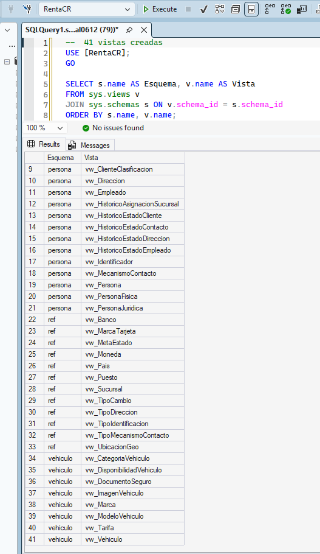
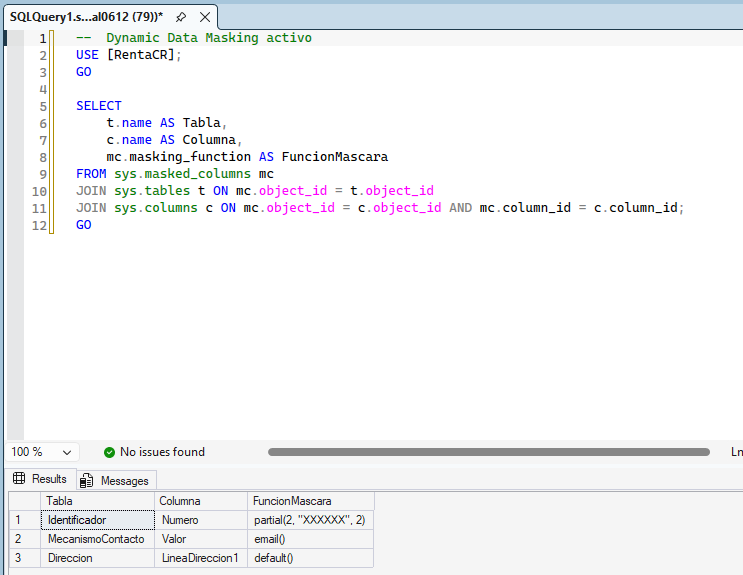
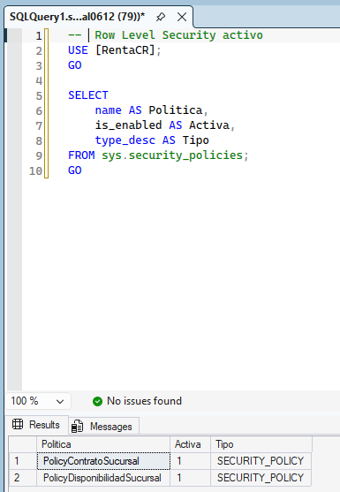
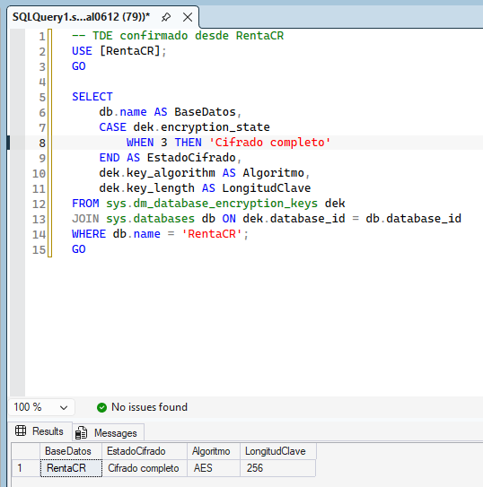
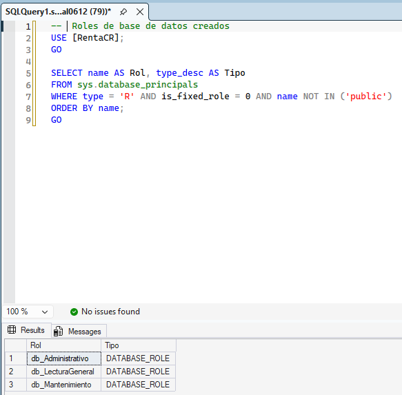

# Bloque 12 — Gestión de Seguridad y Regulación

## Objetivo
Implementar seguridad completa: vistas, roles, enmascaramiento de datos, seguridad a nivel de fila y cifrado.

**Valor:** 10 puntos | **Estado:** ✅ Completado

---

## Vistas (1 por tabla)

Total: **41 vistas** — una por cada tabla de la base de datos.

Toda consulta a datos se hace exclusivamente a través de vistas. Nunca se otorgan permisos directos sobre las tablas base.

| Esquema | Vistas |
|---------|--------|
| ref | vw_Pais, vw_Moneda, vw_UbicacionGeo, vw_MetaEstado, vw_TipoMecanismoContacto, vw_TipoDireccion, vw_TipoIdentificacion, vw_MarcaTarjeta, vw_Banco, vw_Puesto, vw_TipoCambio, vw_Sucursal |
| persona | vw_Persona, vw_PersonaFisica, vw_PersonaJuridica, vw_Cliente, vw_HistoricoEstadoCliente, vw_ClasificacionCliente, vw_ClienteClasificacion, vw_AtributoCliente, vw_Identificador, vw_MecanismoContacto, vw_HistoricoEstadoContacto, vw_Direccion, vw_HistoricoEstadoDireccion, vw_Empleado, vw_HistoricoAsignacionSucursal, vw_HistoricoEstadoEmpleado |
| vehiculo | vw_Marca, vw_ModeloVehiculo, vw_CategoriaVehiculo, vw_Vehiculo, vw_DocumentoSeguro, vw_ImagenVehiculo, vw_Tarifa, vw_DisponibilidadVehiculo |
| alquiler | vw_Contrato, vw_Devolucion, vw_FormaPago, vw_PagoTarjeta, vw_PagoTransferencia |

---

## Roles de Base de Datos

| Rol | Permisos | Objetos |
|-----|----------|---------|
| db_Administrativo | SELECT, INSERT, UPDATE, DELETE, EXECUTE | Todas las tablas + vistas + SPs |
| db_Mantenimiento | SELECT, INSERT, UPDATE, DELETE | Todas las tablas |
| db_LecturaGeneral | SELECT | Todas las vistas |

> Nunca se otorgan permisos directos a los objetos principales. Todo acceso es a través de vistas.

---

## Dynamic Data Masking (DDM)

| Tabla | Columna | Función de Máscara | Datos protegidos |
|-------|---------|-------------------|-----------------|
| persona.MecanismoContacto | Valor | email() | Correos electrónicos |
| persona.Identificador | Numero | partial(2,"XXXXXX",2) | Números de cédula |
| persona.Direccion | LineaDireccion1 | default() | Direcciones físicas |

**Cumplimiento:** Ley de Protección de Datos Personales de Costa Rica (Ley 8968)

---

## Row Level Security (RLS)

### Política en alquiler.Contrato

| Parámetro | Valor |
|-----------|-------|
| Política | PolicyContratoSucursal |
| Función | alquiler.fn_RLS_Sucursal |
| Tipo | FILTER PREDICATE |
| Lógica | Administrativos ven todo; agentes solo ven contratos de su sucursal |

### Política en vehiculo.DisponibilidadVehiculo

| Parámetro | Valor |
|-----------|-------|
| Política | PolicyDisponibilidadSucursal |
| Función | alquiler.fn_RLS_Sucursal_InMemory |
| Tipo | FILTER PREDICATE |
| Nota | Función NATIVE_COMPILATION por ser tabla in-memory |

---

## Transparent Data Encryption (TDE)

| Parámetro | Valor |
|-----------|-------|
| Estado | Cifrado completo (encryption_state = 3) |
| Algoritmo | AES_256 |
| Certificado | CertTDE_RentaCR |
| Alcance | Archivos .mdf, .ldf y .bak de RentaCR |

---

## Cumplimiento Regulatorio

| Regulación | Mecanismo aplicado |
|------------|--------------------|
| Ley 8968 (Protección datos personales CR) | DDM en correo, cédula y dirección |
| Confidencialidad de datos en reposo | TDE AES-256 |
| Control de acceso por rol | Roles + vistas — sin permisos directos |
| Auditoría de accesos | SQL Server Audit — 9 action groups |
| Cifrado en tránsito | Force Encryption TLS 1.2+ |

---

## Evidencias

| # | Archivo | Descripción |
|---|---------|-------------|
| 1 |  | Las 41 vistas creadas organizadas por esquema — único punto de acceso a los datos |
| 2 |  | DDM aplicado: `email()` en correo electrónico, `partial()` en número de cédula, `default()` en dirección |
| 3 |  | Políticas RLS activas: `PolicyContratoSucursal` y `PolicyDisponibilidadSucursal` filtrando por sucursal |
| 4 |  | TDE confirmado en RentaCR: `encryption_state = 3` (cifrado completo) e `is_encrypted = 1` |
| 5 |  | Roles `db_Administrativo`, `db_Mantenimiento` y `db_LecturaGeneral` creados con sus permisos correspondientes |
