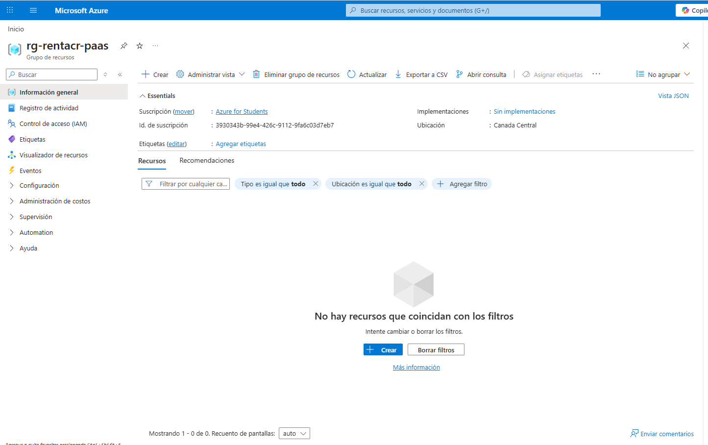
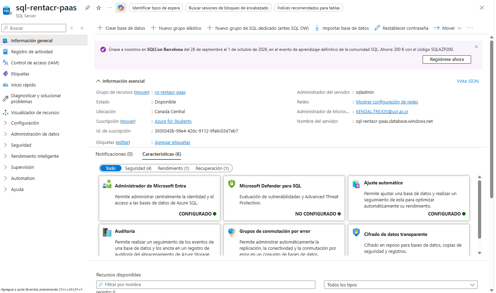
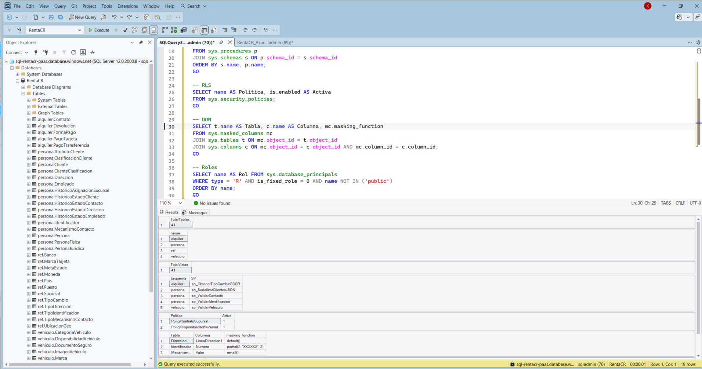
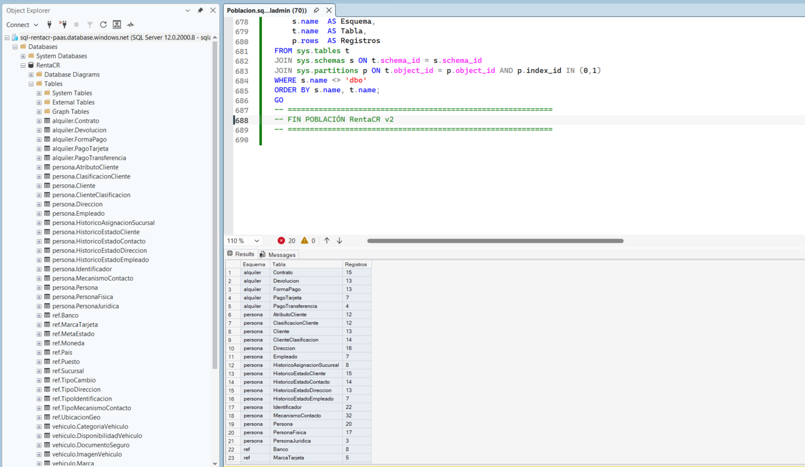
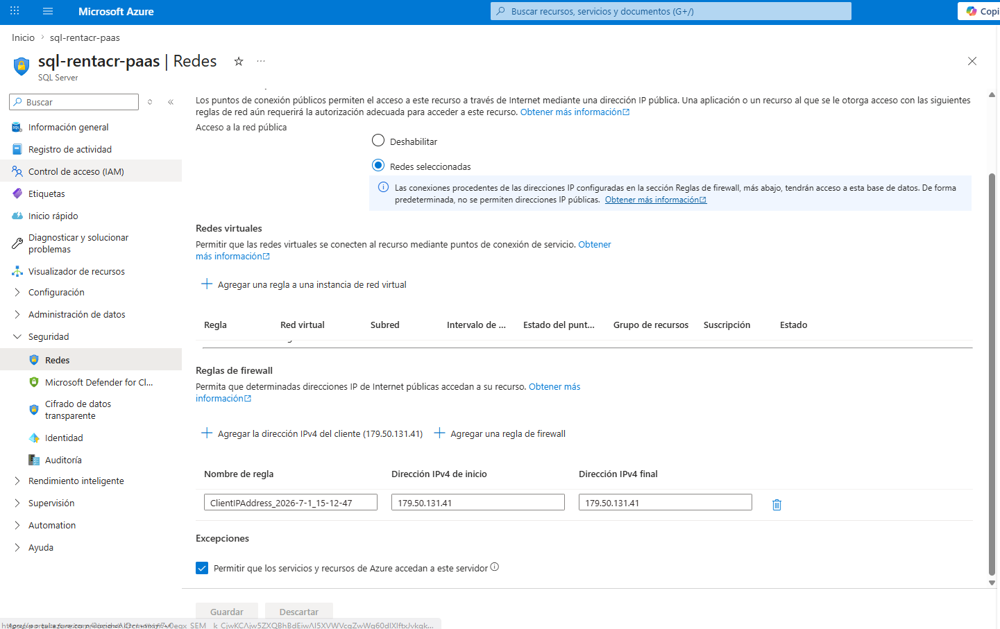

# Bloque 13 — Alta Disponibilidad y la Nube

## Objetivo
Deploy completo de la base de datos RentaCR (metadatos y datos) a Azure SQL Database PaaS, configurado según mejores prácticas.

**Valor:** 10 puntos | **Estado:** ✅ Completo

---

## Infraestructura Azure PaaS

| Componente | Detalle |
|------------|---------|
| **Resource Group** | rg-rentacr-paas |
| **Región** | Canada Central |
| **Azure SQL Server lógico** | sql-rentacr-paas.database.windows.net |
| **Autenticación** | SQL + Microsoft Entra ID (cuenta UCR) |
| **Azure SQL Database** | RentaCR |
| **Tier** | Basic (5 DTUs, 2 GB) |
| **Redundancia** | Local |
| **TDE** | Habilitado automáticamente por Azure (clave administrada por servicio) |
| **TLS mínimo** | 1.2 |

### Configuración de Firewall

| Regla | Estado |
|-------|--------|
| Allow Azure Services | ON |
| IP cliente agregada | ✅ Configurada |

---

## Base de Datos Migrada

### Objetos migrados

| Objeto | Cantidad |
|--------|----------|
| Tablas | 41 |
| Vistas | 41 |
| Esquemas | 4 (alquiler, persona, ref, vehiculo) |
| Stored Procedures | 5 |
| Roles de base de datos | 3 |

### Seguridad activa en PaaS

| Característica | Estado |
|----------------|--------|
| Dynamic Data Masking (DDM) | ✅ Activo — correo, cédula, dirección |
| Row Level Security (RLS) | ✅ Activo — PolicyContratoSucursal + PolicyDisponibilidadSucursal |
| TDE | ✅ Activo — gestionado por Azure |

### Adaptaciones para PaaS

Las siguientes características del entorno IaaS no están disponibles en Azure SQL Database y fueron eliminadas/ajustadas para el deploy en PaaS:

| Característica eliminada | Motivo |
|--------------------------|--------|
| FILESTREAM | No disponible en Azure SQL Database PaaS |
| MEMORY_OPTIMIZED (In-Memory OLTP) | No disponible en tier Basic |
| Filegroups personalizados | No aplica en PaaS (Azure gestiona almacenamiento) |
| Columna VECTOR en tabla Vehiculo | Funcionalidad SS2025 no disponible en Azure SQL Database |

---

## Pasos de Implementación Realizados

| Paso | Descripción | Estado |
|------|-------------|--------|
| 1 | Crear Resource Group rg-rentacr-paas en Canada Central | ✅ Completado |
| 2 | Crear Azure SQL Server lógico sql-rentacr-paas | ✅ Completado |
| 3 | Crear Azure SQL Database RentaCR (Basic, 5 DTUs) | ✅ Completado |
| 4 | Configurar firewall (Allow Azure Services + IP cliente) | ✅ Completado |
| 5 | Configurar autenticación Microsoft Entra ID | ✅ Completado |
| 6 | Adaptar DDL para PaaS (eliminar FILESTREAM, In-Memory, columna VECTOR) | ✅ Completado |
| 7 | Migrar esquema completo (41 tablas, 41 vistas, SPs, roles) | ✅ Completado |
| 8 | Migrar datos (población completa) | ✅ Completado |
| 9 | Verificar DDM, RLS, roles y conteos | ✅ Completado |

---

## Scripts de Verificación

El script de verificación se encuentra en:

```
sql/verificacion/bloque13_azure_paas.sql
```

Ejecutar conectado a `sql-rentacr-paas.database.windows.net`:

```sql
-- Verificar esquemas (debe retornar 4)
SELECT name FROM sys.schemas WHERE name IN ('alquiler','persona','ref','vehiculo');

-- Verificar tablas (debe ser 41)
SELECT COUNT(*) AS TotalTablas FROM sys.tables;

-- Verificar vistas (debe ser 41)
SELECT COUNT(*) AS TotalVistas FROM sys.views;
```

---

## Evidencias

| # | Archivo | Descripción |
|---|---------|-------------|
| 1 |  | Resource Group rg-rentacr-paas creado en Canada Central |
| 2 |  | Azure SQL Server lógico sql-rentacr-paas.database.windows.net |
| 3 |  | Azure SQL Database RentaCR — tier Basic, 5 DTUs, 2 GB |
| 4 |  | Reglas de firewall configuradas — Allow Azure Services ON + IP cliente |
| 5 |  | SSMS conectado a sql-rentacr-paas.database.windows.net con BD RentaCR visible |
